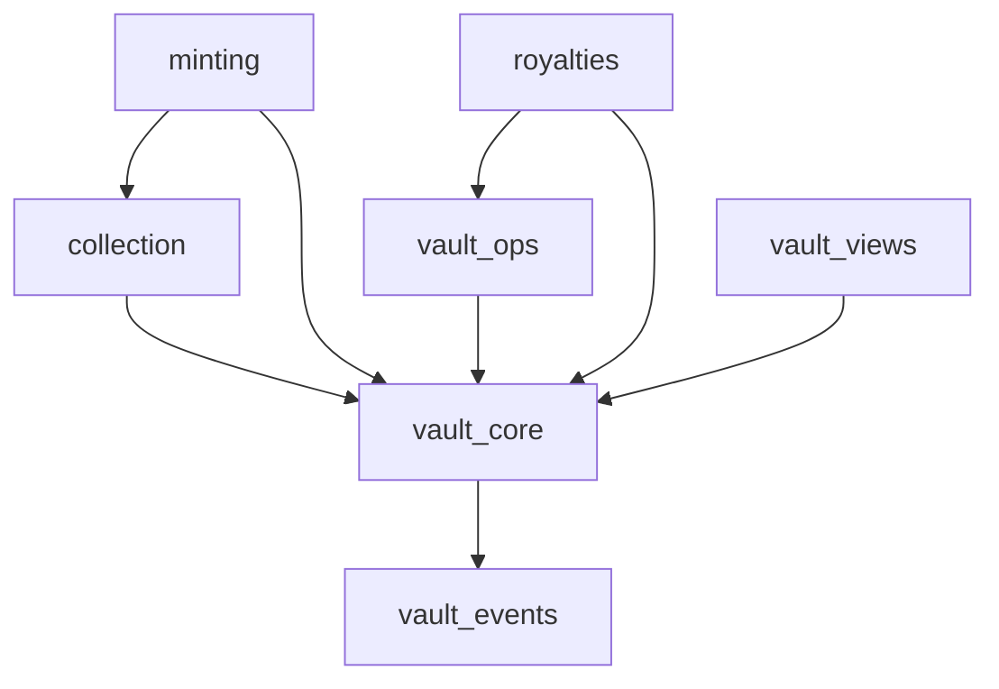

# CVN-1 v2 Improvements

> Prioritized roadmap for hardening CVN-1 into a production-ready, spec-level vaulted NFT standard on Cedra.

---

## Phase 0: Modular Architecture

> **Priority:** Foundational refactoring before other improvements

### Current Problem

The contract is a **monolithic 997-line single file** (`vaulted_collection.move`) containing:
- Data structures
- Events  
- 6+ entry functions
- Internal helpers
- View functions
- Tests

This makes it harder to maintain, test independently, and extend.

### Proposed Module Structure

```
contracts/cvn1_vault/sources/
├── vault_core.move          # Core structs: VaultInfo, VaultedCollectionConfig
├── vault_events.move        # All event definitions
├── collection.move          # Collection initialization & config management
├── minting.move             # All mint variants (creator, public, self)
├── vault_ops.move           # deposit_to_vault, burn_and_redeem
├── royalties.move           # settle_sale_with_vault_royalty
├── vault_views.move         # All #[view] functions
└── tests/
    ├── collection_tests.move
    ├── minting_tests.move
    ├── vault_ops_tests.move
    └── royalties_tests.move
```

### Module Dependencies



### Module Breakdown

#### `vault_core.move` (~80 lines)
```move
module cvn1_vault::vault_core {
    // Core data structures
    struct VaultedCollectionConfig has key { ... }
    struct VaultInfo has key { ... }
    struct VaultBalance has copy, drop { ... }
    
    // Error codes
    const ENOT_CREATOR: u64 = 1;
    const ENOT_OWNER: u64 = 2;
    // ... etc
    
    // Constants
    const MAX_BPS: u64 = 10000;
    
    // Friend declarations for internal access
    friend cvn1_vault::collection;
    friend cvn1_vault::minting;
    friend cvn1_vault::vault_ops;
    friend cvn1_vault::royalties;
}
```

#### `vault_events.move` (~50 lines)
```move
module cvn1_vault::vault_events {
    #[event] struct VaultedNFTMinted has drop, store { ... }
    #[event] struct VaultDeposited has drop, store { ... }
    #[event] struct VaultRedeemed has drop, store { ... }
    #[event] struct RoyaltySettled has drop, store { ... }
}
```

#### `collection.move` (~60 lines)
```move
module cvn1_vault::collection {
    use cvn1_vault::vault_core;
    use cvn1_vault::vault_events;
    
    /// Initialize a vaulted collection - returns collection address
    public entry fun init_collection_config(...): address { ... }
    
    // Config update functions (if needed later)
    public entry fun update_royalty_bps(...) { ... }
}
```

#### `minting.move` (~200 lines)
```move
module cvn1_vault::minting {
    use cvn1_vault::vault_core;
    use cvn1_vault::vault_events;
    use cvn1_vault::vault_ops;
    
    public entry fun creator_mint_vaulted_nft(...) { ... }
    public entry fun creator_self_mint(...) { ... }
    public entry fun public_mint(...) { ... }
    
    // Internal: shared minting logic
    fun create_vault_for_token(...) { ... }
    fun handle_mint_payment(...) { ... }
}
```

#### `vault_ops.move` (~150 lines)
```move
module cvn1_vault::vault_ops {
    use cvn1_vault::vault_core;
    use cvn1_vault::vault_events;
    
    public entry fun deposit_to_vault(...) { ... }
    public entry fun burn_and_redeem(...) { ... }
    
    // Internal helpers (exposed to friends)
    public(friend) fun deposit_fa_to_vault(...) { ... }
    fun withdraw_from_store(...) { ... }
}
```

#### `royalties.move` (~80 lines)
```move
module cvn1_vault::royalties {
    use cvn1_vault::vault_core;
    use cvn1_vault::vault_events;
    use cvn1_vault::vault_ops;
    
    public entry fun settle_sale_with_vault_royalty(...) { ... }
    
    // Future: batch settlement, different royalty models
}
```

#### `vault_views.move` (~100 lines)
```move
module cvn1_vault::vault_views {
    use cvn1_vault::vault_core;
    
    #[view] public fun get_vault_balances(...) { ... }
    #[view] public fun get_vault_config(...) { ... }
    #[view] public fun vault_exists(...) { ... }
    #[view] public fun last_sale_used_vault_royalty(...) { ... }
    #[view] public fun get_vault_info(...) { ... }
    #[view] public fun get_token_metadata(...) { ... }  // New
}
```

### Cedra Best Practices Applied

> Based on [Cedra Move Modules Documentation](https://docs.cedra.network/move/modules)

#### Visibility Control
From the docs: *"Move's visibility system is what makes modules secure. Unlike traditional programming where everything is often accessible by default, Move makes you explicitly declare what's public."*

| Visibility | Use Case |
|------------|----------|
| `fun` (private) | Internal helpers like `withdraw_from_store` |
| `public fun` | API for other modules like `deposit_fa_to_vault` |
| `public entry fun` | User-facing transactions like `public_mint` |
| `public(friend) fun` | Trusted cross-module calls like vault operations |

#### Friend Declarations
The docs recommend friend functions for *"administrative functions, cross-module protocols, privileged operations"*:

```move
module cvn1_vault::vault_ops {
    friend cvn1_vault::minting;
    friend cvn1_vault::royalties;
    
    public(friend) fun deposit_fa_to_vault(...) { ... }
}
```

#### Test Module Pattern
From the docs: *"Tests live in separate test-only modules. They can access private functions and create test scenarios that would be impossible in production."*

```move
#[test_only]
module cvn1_vault::minting_tests {
    use cvn1_vault::minting;
    use cvn1_vault::vault_core;
    
    #[test]
    fun test_public_mint_creates_vault() { ... }
}
```

#### Single Responsibility Principle
The docs show a marketplace example that mirrors our approach:
- `marketplace::token` — token creation and management
- `marketplace::trading` — marketplace logic

Our CVN-1 equivalent:
- `vault_core` — data structures
- `minting` — token creation with vaults
- `vault_ops` — deposit/redeem logic
- `royalties` — sale settlement

### Benefits

| Aspect | Monolithic | Modular |
|--------|------------|---------|
| **File size** | 997 lines | ~60-200 lines each |
| **Testing** | All-or-nothing | Per-module isolation |
| **Onboarding** | Scan entire file | Read relevant module |
| **Extension** | Edit core file | Add new module |
| **Compilation** | Full recompile | Incremental |

### Migration Path

1. Create new module files with empty shells
2. Move structs and constants to `vault_core`
3. Move events to `vault_events`
4. Move entry functions to their modules
5. Add `friend` declarations for internal access
6. Move tests to separate `*_tests.move` files
7. Verify all tests pass
8. Delete old monolithic file

---

## Current State Assessment

### ✅ What's Already Nailed

| Feature | Implementation |
|---------|----------------|
| **Per-NFT Multi-Asset Vaults** | `VaultInfo` with `SmartTable<address, address>` mapping FA metadata → FungibleStore |
| **Configurable Collection Economics** | `VaultedCollectionConfig` with royalty bps, mint pricing, allowlists |
| **Mint Flows** | `init_collection_config`, `creator_mint_vaulted_nft`, `public_mint` |
| **Open Vault Deposits** | Anyone can pump an NFT's vault via `deposit_to_vault` |
| **Burn-to-Redeem** | `burn_and_redeem` destroys NFT and distributes vault contents |
| **Royalty Settlement** | `settle_sale_with_vault_royalty` for compliant secondary sales |
| **Events & Views** | Full indexer support with events and view functions |

---

## Phase 1: Critical Bug Fixes

> **Priority:** Must fix before any testnet usage

### 1.1 Collection Config Guard Missing

**Problem:** `ECOLLECTION_ALREADY_EXISTS` error code is defined but never enforced. Tests expect this abort but the guard doesn't exist.

**Fix:**
```move
public entry fun init_collection_config(...) {
    let constructor_ref = collection::create_unlimited_collection(...);
    let collection_signer = object::generate_signer(&constructor_ref);
    let collection_addr = signer::address_of(&collection_signer);

    // ADD THIS GUARD
    assert!(
        !exists<VaultedCollectionConfig>(collection_addr),
        ECOLLECTION_ALREADY_EXISTS
    );

    move_to(&collection_signer, VaultedCollectionConfig { ... });
}
```

### 1.2 Return Collection Address from Init

**Problem:** `init_collection_config` creates a collection but never surfaces its address. Tests and frontends can't know what to pass to `public_mint`.

**Fix:**
```move
public fun init_collection_config(...): address {
    // ... existing logic ...
    let collection_addr = signer::address_of(&collection_signer);
    // ... move_to config ...
    collection_addr  // Return it
}
```

### 1.3 Test Address Mismatch

**Problem:** Tests use `@0x123` as if it's the collection address, but config is stored on the **collection object**, not creator address.

**Fix:** Update all tests to:
1. Capture the returned collection address from `init_collection_config`
2. Pass that address to `get_vault_config`, `public_mint`, etc.

```move
let collection_addr = init_collection_config(...);
let (creator_bps, vault_bps, assets, payout) = get_vault_config(collection_addr);
```

---

## Phase 2: Resource Cleanup

> **Priority:** Important for production cleanliness

### 2.1 Delete Empty FungibleStore Objects

**Problem:** `burn_and_redeem` withdraws all funds and destroys the `SmartTable`, but leaves orphaned empty `FungibleStore` objects.

**Fix:** After withdrawing from each store, delete the store object:

```move
fun burn_and_redeem(...) {
    // ... existing withdrawal logic ...
    
    // For each store after withdrawal:
    let store_signer = object::generate_signer_for_extending(&extend_ref);
    fungible_asset::remove_store(&store_signer);  // or equivalent cleanup
}
```

### 2.2 Use DeleteRef Where Available

**Problem:** `VaultInfo` stores an optional `DeleteRef` but `burn_and_redeem` ignores it.

**Fix:** If `delete_ref` is `Some`, use it to fully delete the NFT object after burning the token.

---

## Phase 3: Semantic Consistency

> **Priority:** Design decisions to clarify

### 3.1 Allowlist Enforcement Decision

**Current Behavior:**
- `deposit_to_vault` (external) → **checks** `allowed_assets`
- `deposit_fa_to_vault` (internal) → **bypasses** allowlist

**Decision Required:**

| Option | Behavior |
|--------|----------|
| **A: Intentional** | Protocol mint/sale flows can deposit any FA; allowlist only restricts external deposits |
| **B: Strict** | All deposits (internal + external) must respect allowlist |

> [!IMPORTANT]
> Document whichever choice is made. If Option A, add a comment in `deposit_fa_to_vault` explaining the bypass is intentional.

---

## Phase 4: Royalty Compliance Tracking

> **Priority:** Ecosystem clarity

### 4.1 Document the Compliance Model

**Current Reality:**
- `settle_sale_with_vault_royalty` is the **only** path that enforces royalties
- Sets `last_sale_compliant = true` on settlement
- Standard `object::transfer` or `token::transfer` can bypass this entirely

**This is NOT a bug** — it's a fundamental limit of shared token standards on Cedra.

**Action:** Create clear documentation:

```markdown
## CVN-1 Compliance Model

CVN-1 provides a **standardized, strongly-encouraged sale path** with verifiable 
compliance tracking, not cryptographic enforcement.

### For Marketplaces
To be CVN-1 compliant, call `settle_sale_with_vault_royalty` for all settlements.
Any other transfer path is non-compliant and won't update `last_sale_compliant`.

### For Collectors
Check `last_sale_used_vault_royalty(nft_addr)` to verify provenance.
```

### 4.2 Optional: Soft Guard on Non-Standard Transfers

If additional transfer entry points are added later, provide a helper that sets `last_sale_compliant = false`:

```move
public fun mark_non_compliant_transfer(nft_object: Object<Token>) {
    let vault_info = borrow_global_mut<VaultInfo>(object::object_address(&nft_object));
    vault_info.last_sale_compliant = false;
}
```

---

## Phase 5: Developer Experience Polish

> **Priority:** Nice-to-have for spec adoption

### 5.1 Metadata Passthrough View

```move
#[view]
public fun get_token_metadata(nft_object: Object<Token>): (String, String, String) {
    let token_addr = object::object_address(&nft_object);
    (
        token::name(nft_object),
        token::description(nft_object),
        token::uri(nft_object)
    )
}
```

### 5.2 Collection Address Helper

```move
#[view]
public fun get_collection_address(collection_name: String, creator: address): address {
    collection::create_collection_address(&creator, &collection_name)
}
```

### 5.3 Vault Summary View

```move
#[view]
public fun get_vault_summary(nft_addr: address): (u64, vector<address>) acquires VaultInfo {
    let vault_info = borrow_global<VaultInfo>(nft_addr);
    let total_assets = smart_table::length(&vault_info.vault_stores);
    let asset_types = vector::empty<address>();
    
    smart_table::for_each_ref(&vault_info.vault_stores, |fa_addr, _store_addr| {
        vector::push_back(&mut asset_types, *fa_addr);
    });
    
    (total_assets, asset_types)
}
```

---

## Phase 6: Documentation & Spec

> **Priority:** For ecosystem adoption

### 6.1 CVN-1 Specification README

Create a standalone spec document covering:

1. **Abstract** — What CVN-1 is and why it exists
2. **Terminology** — Vault, VaultInfo, Compliant Sale, etc.
3. **Data Structures** — `VaultInfo`, `VaultedCollectionConfig`
4. **Entry Functions** — Full signatures with parameter descriptions
5. **View Functions** — All views with return types
6. **Events** — Event structures for indexing
7. **Integration Guide** — Step-by-step for marketplaces
8. **Security Considerations** — Compliance model limitations

### 6.2 Integration Examples

Provide TypeScript SDK examples:

```typescript
// Minting a vaulted NFT
const txn = await cedra.transaction.build.simple({
  sender: creator.accountAddress,
  data: {
    function: `${CVN1_ADDRESS}::vaulted_collection::public_mint`,
    functionArguments: [collectionAddr, "My NFT", "desc", "uri"],
  },
});

// Settling a sale with vault royalty
const settleTxn = await cedra.transaction.build.simple({
  sender: marketplace.accountAddress,
  data: {
    function: `${CVN1_ADDRESS}::vaulted_collection::settle_sale_with_vault_royalty`,
    functionArguments: [nftAddr, collectionAddr, buyerAddr, grossAmount, paymentFA],
  },
});
```

---

## Implementation Checklist

### Phase 1: Critical *(Do First)*
- [ ] Add `exists<VaultedCollectionConfig>` guard in `init_collection_config`
- [ ] Return collection address from `init_collection_config`
- [ ] Fix all test cases to use correct collection addresses

### Phase 2: Cleanup
- [ ] Delete empty `FungibleStore` objects in `burn_and_redeem`
- [ ] Utilize `DeleteRef` if present

### Phase 3: Semantics
- [ ] Document allowlist bypass decision
- [ ] Add inline comments explaining intentional design choices

### Phase 4: Compliance
- [ ] Create compliance model documentation
- [ ] Consider adding `mark_non_compliant_transfer` helper

### Phase 5: DX
- [ ] Add `get_token_metadata` view
- [ ] Add `get_collection_address` helper view
- [ ] Add `get_vault_summary` view

### Phase 6: Spec
- [ ] Write CVN-1 specification README
- [ ] Create TypeScript integration examples
- [ ] Add marketplace integration guide

---

## References

- [Cedra Documentation](https://docs.cedra.network/)
- [Cedra Move Guide](https://docs.cedra.network/move)
- [Real World Guides](https://docs.cedra.network/real-world-guides)
- [Indexer Documentation](https://docs.cedra.network/indexer)
